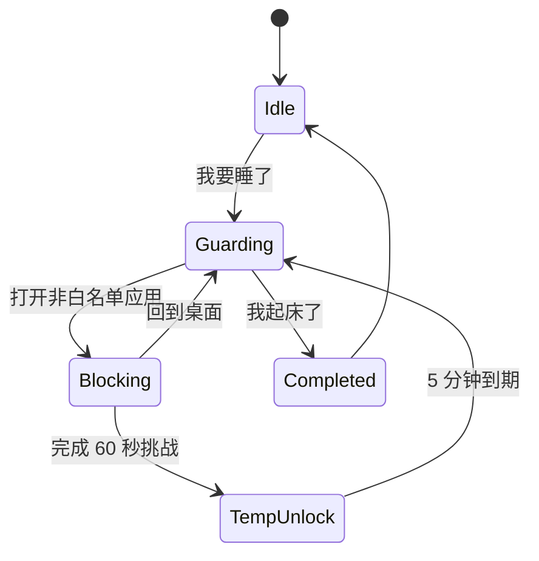

# Bedtime Saver AI 开发者指南

这份文档是给后续接手本项目的 AI 开发者看的，不是普通用户说明。目标是：让没有参与过「睡前救星 Bedtime Saver」开发的 AI 读完后，可以直接进入开发状态，并且不偏移当前 App 的技术路线、视觉风格、数据安全和发布流程。

任何 AI 在修改本项目之前，必须先完整阅读本文件、`README.md`、`CHANGELOG.md`，再开始动手。

## 1. 项目定位

Bedtime Saver 是一个 Android 防沉迷与早睡习惯养成 App。核心体验是：

- 用户设定目标入睡时间。
- 睡前点击「我要睡了」进入睡眠监督状态。
- 监督状态下打开分心应用会被全屏阻断页拦截。
- 强行解锁需要完成 60 秒清醒挑战。
- 监督状态下系统闹钟/时钟应用必须被放行，避免影响闹钟响起和关闭。
- 第二天打开 App 点击「我起床了」完成晨起打卡。
- App 统计睡眠时长、早睡达标状态、连续早睡天数，并用月历点阵展示历史。

这个项目适合简历展示，必须保持源码、设计稿、文档、发行 APK、GitHub Release 的完整性。

## 2. 当前技术栈

- Kotlin
- Jetpack Compose / Material 3
- MVVM + `StateFlow`
- Room + KSP
- `AccessibilityService`
- `SharedPreferences`
- Gradle Wrapper 9.4.1
- Android Gradle Plugin 9.2.1
- `compileSdk`: 36
- `minSdk`: 26
- `targetSdk`: 36

AGP 9 已内置 Android Kotlin 支持，不要再添加旧的 `org.jetbrains.kotlin.android` 插件。

## 3. 关键目录

```text
app/src/main/java/com/bedtimesaver/
├── MainActivity.kt                         # 主入口，装配 Repository / ViewModel / HomeScreen
├── data/
│   ├── BedtimeDatabase.kt                  # Room database
│   ├── BedtimeSettings.kt                  # 目标入睡时间
│   ├── DailySleepRecord.kt                 # 每日睡眠记录实体
│   ├── SleepRecordDao.kt                   # Room DAO
│   └── SleepRepository.kt                  # 打卡、删除、连续天数、监督状态调度
├── domain/
│   ├── SleepDatePolicy.kt                  # 睡眠日归属和目标时间规则
│   └── TargetBedtime.kt                    # 目标入睡时间值对象
├── service/
│   ├── AccessibilityPermission.kt          # 无障碍权限检测
│   ├── BedtimeAccessibilityService.kt      # 前台应用检测与阻断触发
│   ├── BedtimeAlarmReceiver.kt             # 兼容取消旧版自动监督闹钟，不再开启监督
│   ├── BootReceiver.kt                     # 开机后重新调度
│   └── SleepModeStore.kt                   # 睡眠监督状态与白名单
└── ui/
    ├── BlockActivity.kt                    # 全屏阻断页与 60 秒挑战
    ├── HomeScreen.kt                       # 今晚 / 记录 两个板块
    ├── HomeUiState.kt                      # UI 状态模型
    ├── MainViewModel.kt                    # UI 状态聚合和交互入口
    └── theme/Theme.kt                      # 深色视觉主题
```

设计稿和发行文件：

```text
design/stitch_bedtime_saver_sleep_assistant/ # Stitch 设计稿和截图
release/BedtimeSaver-v1.2.2.apk              # 当前发行展示包
release/README.md                            # 当前发行包 SHA-256
CHANGELOG.md                                 # 每次修改必须更新
```

## 4. 开工前必须检查

每次修改前先执行并理解：

```powershell
git status -sb
git branch --show-current
Get-Content -Encoding UTF8 CHANGELOG.md
Get-Content -Encoding UTF8 README.md
Get-Content -Encoding UTF8 DEVELOP.md
```

还要查看版本：

```powershell
Select-String -Path app\build.gradle.kts -Pattern "versionCode|versionName"
Get-ChildItem release
```

规则：

- 默认在 `main` 分支开发，不要擅自新建分支或 PR，除非用户明确要求。
- 如果工作区已有未提交改动，必须视为用户已有工作，不能回退、覆盖或清理。
- 先读相关代码再修改，不要凭记忆动 UI、数据模型或发布流程。

## 5. 改动范围规范

每次只处理用户本次明确提出的问题：

- 不要顺手重构无关代码。
- 不要擅自新增功能。
- 不要改动无关页面、无关数据表、无关文档。
- 不要删除用户放入项目的文件，例如根目录 `icon.png`、`design/` 下的设计稿，除非用户明确要求。
- 如果发现额外问题，最终回复里说明即可，不要混进本次改动。

## 6. UI 与设计轨道

当前视觉来自 `design/stitch_bedtime_saver_sleep_assistant/nocturnal_minimalism/DESIGN.md`，核心关键词是：

- Nocturnal Minimalism
- 深色低亮度背景
- 柔和浅蓝主色
- 鼠尾草绿成功色
- 低对比细描边
- 8dp 以内圆角
- 克制、安静、工具型

必须保持：

- 主背景接近 `#131313`。
- 卡片接近 `#1A1A1A`，描边接近 `#37474F`。
- 主按钮使用柔和浅蓝，不要改成高饱和色。
- 成功/达标状态使用绿色系。
- 文案优先中文。
- 不要改成营销落地页、渐变英雄页、浅色主题或卡通风。
- 底部只有两个主板块：「今晚」「记录」。
- 阻断页保持全屏 Deep Rest Mode 风格，不要退回普通弹窗或小卡片。

如果用户提供新设计稿，先读 `design/` 文件，再把视觉映射到 Compose；不要只按文字猜。

## 7. 数据与业务规则

`DailySleepRecord` 以睡眠日 `date` 为主键。凌晨到中午之前的打卡归属前一天，避免“晚上睡觉、早上起床”被自然日切开。

| 字段 | 含义 |
| --- | --- |
| `date` | 睡眠日，格式 `yyyy-MM-dd` |
| `bedtimeCheckInMillis` | 睡前打卡时间 |
| `wakeUpCheckInMillis` | 晨起打卡时间 |
| `targetBedtimeMinutes` | 当天目标入睡分钟数 |
| `metGoal` | 睡前打卡是否早于或等于目标时间 |
| `streakCount` | 截至该睡眠日的连续早睡达标天数 |
| `sleepDurationMinutes` | 睡前到晨起的实际间隔 |

关键规则：

- `SleepRepository.checkInBed()` 负责睡前打卡、达标判断、连续天数计算、开启监督。
- `SleepRepository.checkInWakeUp()` 负责晨起打卡、睡眠时长计算、关闭监督。
- 目标入睡时间只用于达标判断，不能调度或触发自动监督。
- `SleepRepository.deleteRecord()` 负责删除误触记录，并重新计算连续天数。
- `SleepRepository.supplementRecord()` 负责补充打卡，手动写入睡眠日、入睡时间、起床时间，并重算连续天数。
- 删除当前监督周期记录时，要退出监督状态，避免记录不存在但仍锁定。
- 修改 Room 表结构时，必须提升数据库版本并添加 migration，不能破坏旧数据。
- 默认不要清空数据库、不要做 destructive migration。

## 8. 无障碍与监督机制

当前监督链路：



注意：

- Android 不允许 App 自动开启无障碍服务，必须用户手动开启。
- 本项目不是系统级锁屏 App，不能承诺真正熄屏或系统锁屏。
- `AccessibilityService` 只读取前台包名，不读取页面内容。
- 白名单在 `SleepModeStore`，自身 App 包名必须始终放行，确保用户能回到 App 点击「我起床了」。
- 常见系统时钟/闹钟应用必须放行，确保监督状态不影响系统闹钟响起和关闭。
- `BedtimeAlarmReceiver` 仅用于取消旧版可能遗留的自动监督闹钟，禁止在其中调用 `SleepModeStore.activate()`。

## 9. 版本号规范

只要修改影响 App 行为、UI、资源、数据、构建产物或用户可下载 APK，必须更新：

- `app/build.gradle.kts` 的 `versionCode` 递增 1。
- `app/build.gradle.kts` 的 `versionName` 顺延，例如 `1.0.0` 后为 `1.0.1`。
- `CHANGELOG.md` 顶部新增对应版本条目。
- 重新构建并更新 `release/BedtimeSaver-vX.Y.Z.apk`。
- 更新 `release/README.md` 的文件名和 SHA-256。
- 推送到 GitHub。
- 创建或更新 GitHub Release，并上传 APK 附件。

纯文档或开发规范修改一般不改 App 版本号，也不生成新 APK；但仍必须更新 `CHANGELOG.md`，并提交推送到 GitHub。

## 10. CHANGELOG 规范

每次修改都必须更新 `CHANGELOG.md`，最新条目永远在最顶部。

格式：

```markdown
## 1.0.1 - 2026-05-20

### 修复

- 修复底部导航在系统导航栏下被遮挡的问题。

### 优化

- 更新发行图标资源。
```

要求：

- 日期格式为 `yyyy-MM-dd`。
- 文案说明用户或后续开发者能感知的变化。
- 修 bug 要写清楚修复对象。
- 涉及数据迁移要写清楚是否保护旧数据。
- GitHub 上的 `CHANGELOG.md` 必须与本地一致。

## 11. 构建与发行目录

当前本地展示包使用 `portfolio` 构建类型：

```powershell
.\gradlew.bat assemblePortfolio
```

构建后复制到 `release/`：

```powershell
Copy-Item app\build\outputs\apk\portfolio\app-portfolio.apk release\BedtimeSaver-v版本号.apk -Force
```

计算 SHA-256：

```powershell
Get-FileHash release\BedtimeSaver-v版本号.apk -Algorithm SHA256
```

要求：

- 用户可下载版本统一放在 `release/`。
- 文件命名统一为 `BedtimeSaver-v版本号.apk`。
- 不要把最终交付路径说成 `app/build/outputs/...`，那只是中间构建产物。
- `release/README.md` 必须与当前发行包一致。

## 12. GitHub 同步规范

本项目要求：每进行一次修正或升级，都必须上传到 GitHub，并上传版本更新说明。

完整流程：

1. 确认当前分支：

```powershell
git status -sb
git branch --show-current
```

2. 修改代码或文档。
3. 更新 `CHANGELOG.md`。
4. 如果是 App 版本更新，更新版本号、构建 APK、复制到 `release/`、更新 SHA-256。
5. 运行验证命令。
6. 检查 diff 范围：

```powershell
git diff --stat
git status -sb
```

7. 提交并推送：

```powershell
git add -A
git commit -m "简短说明"
git push
```

8. 上传版本更新说明：

- App 版本更新：创建或更新 GitHub Release，tag 使用 `v版本号`，Release notes 使用 `CHANGELOG.md` 对应条目，并上传 `release/BedtimeSaver-v版本号.apk`。
- 纯文档/规范修改：推送 `CHANGELOG.md` 即视为更新说明；如用户明确要求 Release，也要创建文档型 Release。

9. 最终回复必须说明 GitHub main 分支、commit、Release/tag 是否完成。

如果 GitHub CLI 不可用，使用可用的 GitHub connector、git push 或 API 方式完成；不能只停在本地。

## 13. 验证规范

每次 App 代码、UI、资源或构建逻辑变更，至少执行：

```powershell
.\gradlew.bat assemblePortfolio
```

如果更新 APK，还要执行：

```powershell
& "$HOME\AppData\Local\Android\Sdk\build-tools\36.0.0\apksigner.bat" verify --verbose release\BedtimeSaver-v版本号.apk
```

如果改了界面或交互，尽量用真机或模拟器验证。没有可用设备时，最终回复必须说明“未做设备截图验证”的原因。

如果改了数据库：

- 验证旧数据不会丢失。
- 验证覆盖安装后原记录仍在。
- 验证 migration。
- 验证删除记录后连续天数重算。

## 14. 最终回复规范

每次完成后，最终回复必须包含：

- 改了什么。
- 关键文件路径。
- 是否更新版本号。
- 是否更新 `CHANGELOG.md`。
- 构建是否成功。
- APK 在 `release/` 的准确路径，如果本次不生成 APK，要说明原因。
- GitHub main 分支是否已推送。
- commit hash。
- Release/tag 是否创建或更新。
- 未完成的验证项及原因。

不要把中间产物 `app/build/outputs/...` 当作最终交付文件。

## 15. 发布前检查清单

每次 App 版本发布前逐项确认：

- [ ] 改动只覆盖用户本次要求。
- [ ] 没有擅自改 UI 风格或新增无关功能。
- [ ] `versionCode` 已递增。
- [ ] `versionName` 已顺延。
- [ ] `CHANGELOG.md` 顶部已有对应版本条目。
- [ ] `.\gradlew.bat assemblePortfolio` 通过。
- [ ] APK 已复制到 `release/BedtimeSaver-v版本号.apk`。
- [ ] `release/README.md` SHA-256 已更新。
- [ ] APK 签名校验通过。
- [ ] 数据迁移风险已检查。
- [ ] `git diff --stat` 无异常。
- [ ] GitHub main 分支已推送。
- [ ] GitHub `CHANGELOG.md` 已同步。
- [ ] GitHub Release 已创建或更新。
- [ ] Release APK 附件已上传。
