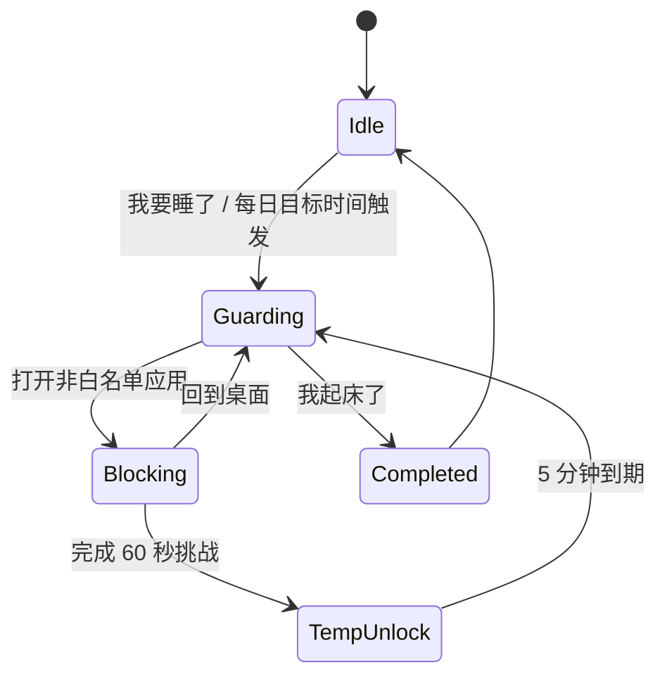

# Bedtime Saver 开发者文档

## 环境与版本

- `compileSdk`: 36
- `minSdk`: 26
- `targetSdk`: 36
- Gradle Wrapper: 9.4.1
- Android Gradle Plugin: 9.2.1
- Kotlin / Compose Compiler: 2.3.21
- Compose BOM: 2026.05.00
- Room: 2.8.4

AGP 9 已内置 Android Kotlin 支持，因此项目没有再应用旧的 `org.jetbrains.kotlin.android` 插件。

## 目录结构

```text
app/src/main/java/com/bedtimesaver/
├── MainActivity.kt
├── data/
│   ├── BedtimeDatabase.kt
│   ├── BedtimeSettings.kt
│   ├── DailySleepRecord.kt
│   ├── SleepRecordDao.kt
│   └── SleepRepository.kt
├── domain/
│   ├── SleepDatePolicy.kt
│   └── TargetBedtime.kt
├── service/
│   ├── AccessibilityPermission.kt
│   ├── BedtimeAccessibilityService.kt
│   ├── BedtimeAlarmReceiver.kt
│   ├── BootReceiver.kt
│   └── SleepModeStore.kt
└── ui/
    ├── BlockActivity.kt
    ├── HomeScreen.kt
    ├── HomeUiState.kt
    ├── MainViewModel.kt
    └── theme/Theme.kt
```

## 数据模型

`DailySleepRecord` 以睡眠日 `date` 为主键。凌晨到中午之前的打卡会归属前一天，避免“晚上睡觉、早上起床”被自然日切开。

| 字段 | 含义 |
| --- | --- |
| `date` | 睡眠日，格式 `yyyy-MM-dd` |
| `bedtimeCheckInMillis` | 睡前打卡时间 |
| `wakeUpCheckInMillis` | 晨起打卡时间 |
| `targetBedtimeMinutes` | 当天目标入睡分钟数 |
| `metGoal` | 睡前打卡是否早于或等于目标时间 |
| `streakCount` | 截至该睡眠日的连续早睡达标天数 |
| `sleepDurationMinutes` | 睡前到晨起的实际间隔 |

## 状态机



## 关键实现

- `SleepRepository.checkInBed()`：写入或更新当天睡前记录，计算 `metGoal` 和 `streakCount`，开启监督状态。
- `SleepRepository.checkInWakeUp()`：写入晨起时间，计算睡眠时长，关闭监督状态。
- `SleepRepository.deleteRecord()`：删除指定睡眠日记录，必要时退出当前监督状态，并重新计算所有记录的连续天数。
- `BedtimeAlarmReceiver`：按目标时间每天调度一次，到点自动进入监督状态。
- `BedtimeAccessibilityService`：监听 `TYPE_WINDOW_STATE_CHANGED` / `TYPE_WINDOWS_CHANGED`，在监督状态下阻断非白名单包名。
- `BlockActivity`：全屏阻断界面，禁用返回键，提供回桌面和 60 秒挑战入口。
- `SleepModeStore`：保存监督状态、当前睡眠日、临时解锁截止时间。

## 白名单策略

当前白名单包含本 App、系统 UI、设置、权限控制器、常见桌面和拨号应用。这样可以避免用户在监督状态下无法回到桌面、无法处理基本系统入口。

若要做成产品级能力，可在后续版本加入：

- 用户自定义允许应用列表。
- 娱乐应用黑名单/分类库。
- 不同强度模式：宽松、标准、严格。
- 家长或搭档监督码。

## 构建与安装

```powershell
.\gradlew.bat assemblePortfolio
```

输出：

```text
app/build/outputs/apk/portfolio/app-portfolio.apk
release/BedtimeSaver-v1.0.0.apk
```

`release/BedtimeSaver-v1.0.0.apk` 是从 `portfolio` 构建产物复制出的发行展示包。该 APK 使用 debug keystore 签名但关闭调试，适合本地演示安装。正式发布建议增加 `keystore.properties`，并在 `release` 中配置正式签名：

```kotlin
signingConfigs {
    create("release") {
        storeFile = file("release.jks")
        storePassword = providers.gradleProperty("STORE_PASSWORD").get()
        keyAlias = providers.gradleProperty("KEY_ALIAS").get()
        keyPassword = providers.gradleProperty("KEY_PASSWORD").get()
    }
}
```

## QA 清单

- 首次启动后，主页能显示目标时间、连续天数和日历点阵。
- 点击“去开启”能跳转系统无障碍设置。
- 启用无障碍服务后，回到 App 点击“刷新”，提示卡片消失。
- 点击“我要睡了”后进入“睡眠监督中”。
- 监督状态下打开第三方应用，弹出全屏阻断页。
- 点击“回到桌面”能回到 Launcher。
- 点击“我要解锁”后必须等待 60 秒，完成后临时解锁 5 分钟。
- 底部导航在手势导航/三键导航设备上不被系统导航栏遮挡。
- 第二天或测试时点击“我起床了”，记录晨起时间和睡眠时长。
- 在“记录”板块删除一条记录后，列表、日历点和连续天数会刷新。
- 重启手机后，`BootReceiver` 会重新调度下一次目标时间监督。

## 已知边界

- AccessibilityService 必须由用户手动开启，Android 不允许 App 自动开启。
- 未使用系统级设备管理员权限，因此不会真正熄屏或锁屏。
- `release` 默认产物未签名，正式发布需要配置 release keystore。
- 当前版本没有云同步，所有数据保存在本地 Room 数据库。
