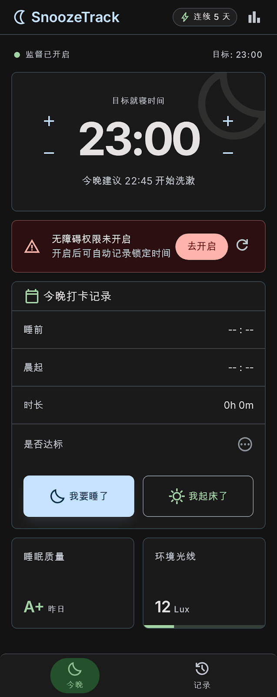
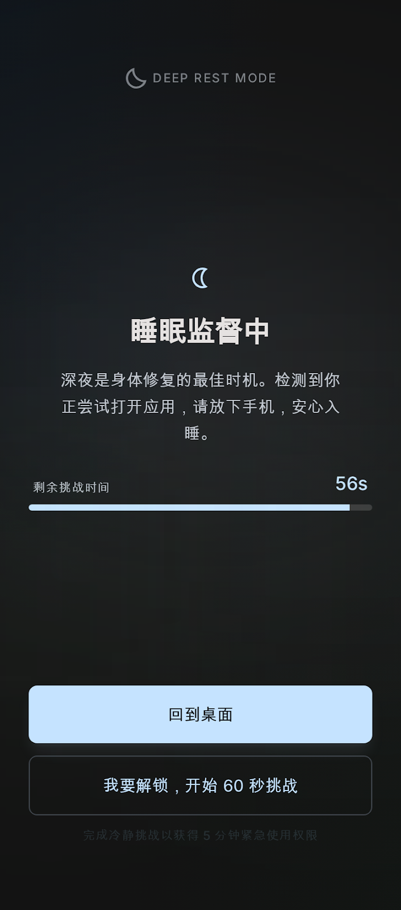
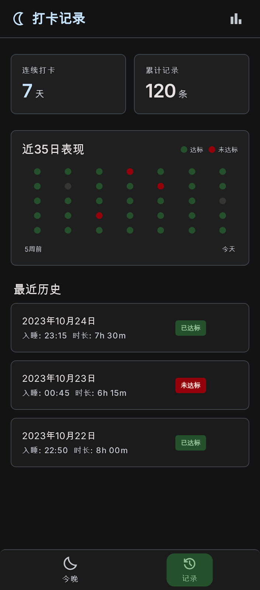
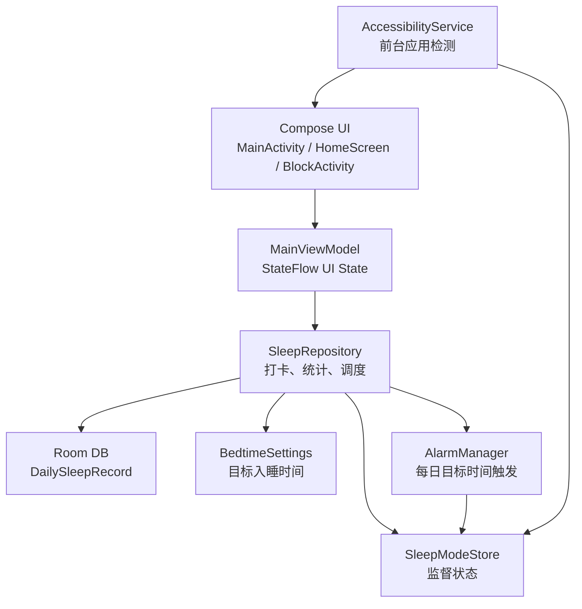

# 睡前救星 Bedtime Saver

一个用 Kotlin + Jetpack Compose 构建的防沉迷与早睡习惯养成 Android App。它围绕“睡前打卡、监督拦截、清醒挑战、晨起确认、连续早睡统计”形成闭环，帮助用户减少躺床刷手机。

项目地址：<https://github.com/XuYui/Bedtime_Saver>

## 预览

| 今晚 | 睡眠监督 | 打卡记录 |
| --- | --- | --- |
|  |  |  |

## 项目亮点

- **睡眠监督模式**：用户点击“我要睡了”或到达目标入睡时间后，App 进入监督状态。
- **无障碍应用拦截**：通过 `AccessibilityService` 监听前台窗口变化，监督状态下打开非白名单应用会立即弹出全屏阻断页。
- **60 秒清醒挑战**：用户坚持要解锁时，需要完成 60 秒倒计时，完成后仅获得 5 分钟临时解锁。
- **早睡打卡系统**：Room 本地数据库记录睡前打卡、晨起打卡、实际睡眠时长、是否达标、连续天数。
- **连续成就与日历点阵**：主页展示连续早睡天数，并用绿/红/灰点呈现最近 35 个睡眠日。
- **误触修正**：记录板块支持删除误触生成的打卡记录，并自动重算连续早睡天数。
- **双板块信息架构**：底部切换“今晚”和“记录”，避免把所有信息堆在单页长滚动中。
- **暗色友好 UI**：Compose + Material 3，低亮度、低刺激、适合夜间使用。

## 技术栈

- Kotlin
- Jetpack Compose / Material 3
- Room + KSP
- MVVM + StateFlow
- AccessibilityService
- AlarmManager
- SharedPreferences for lightweight runtime settings

## 开发协作

- AI 开发接手指南：[DEVELOP.md](DEVELOP.md)
- 更新日志：[CHANGELOG.md](CHANGELOG.md)
- 每次修正或升级都必须同步 GitHub，并更新版本说明。

## 核心架构



## 使用方式

1. 安装 APK 后打开“睡前救星”。
2. 点击“去开启”，在系统无障碍设置里启用“睡前救星监督服务”。
3. 设置目标入睡时间。
4. 上床时点击“我要睡了”，App 会记录睡前打卡并进入监督状态。
5. 监督状态下打开分心应用会出现全屏阻断页。
6. 第二天点击“我起床了”，完成晨起打卡并计算睡眠时长。
7. 如果发生误触，可在“记录”板块删除对应日期记录。

## APK 产物

已生成独立发行目录：

- 发行安装包：`release/BedtimeSaver-v1.0.1.apk`
- 校验信息：`release/README.md`

`portfolio` 使用 debug keystore 签名，适合本机安装、演示和作品集展示；正式发布请使用自己的 release keystore 重新签名。

## 构建命令

```powershell
.\gradlew.bat assemblePortfolio
.\gradlew.bat assembleDebug
.\gradlew.bat assembleRelease
```

## 隐私说明

App 不联网，不上传数据。无障碍服务只在监督状态下读取前台应用包名，用于判断是否需要弹出阻断页；不会读取输入内容、聊天内容或页面文本。

## Android 权限边界

普通 App 不能在没有设备管理员或系统权限的情况下真正锁定手机屏幕。本项目实现的是“睡眠监督锁定模式”：通过无障碍前台检测和全屏阻断增加刷手机摩擦力。若后续需要真实锁屏，可扩展 `DevicePolicyManager` 设备管理员能力。
